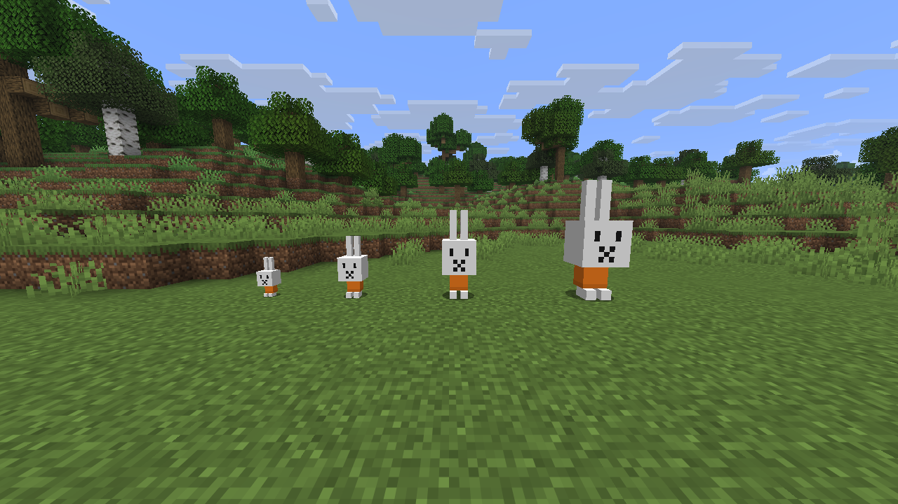
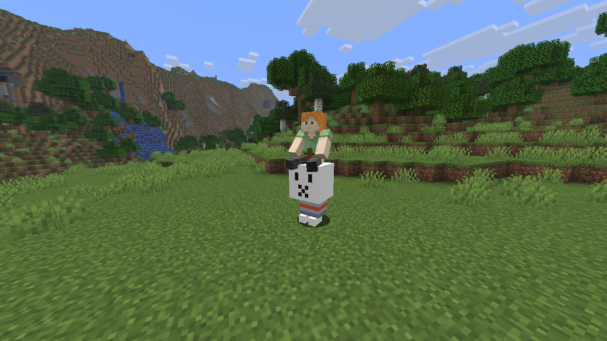
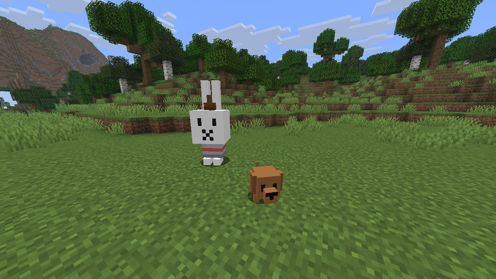
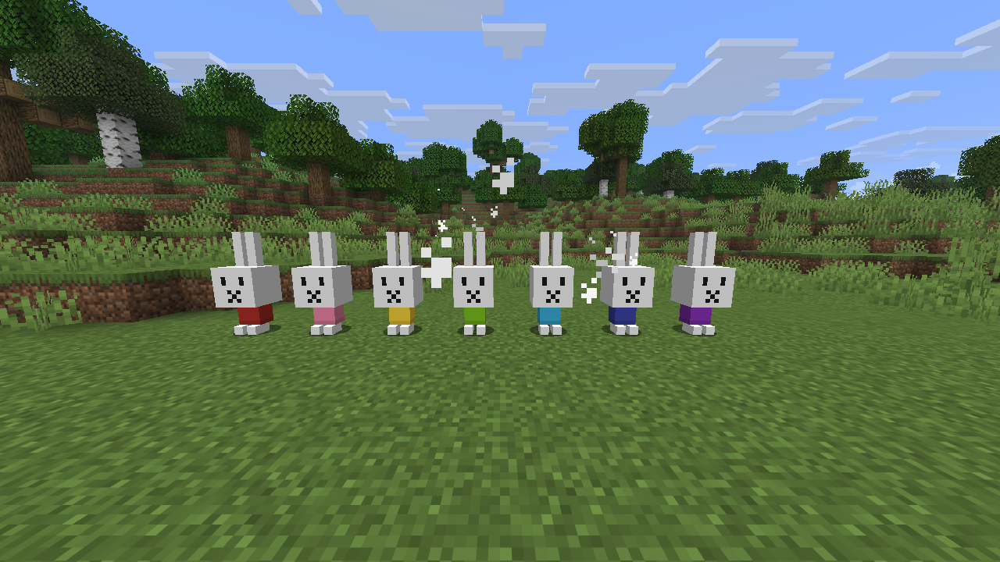
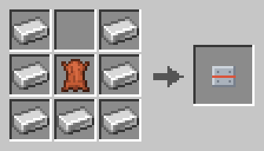

<!-- Generated by modpage from modpage.yml -- edit that file, not this one. -->
<p align="center">
  
</p>

<p align="center"><i>A tamable bunny that grows into a rideable, armoured battle companion - and brings a puppy.</i></p>

<p align="center">
  <a href="https://github.com/mattjesmc/Miffy/releases/latest"></a>
  
  
  
</p>

<p align="center">
<b>Loaders:</b> Fabric &nbsp;•&nbsp; <b>Minecraft:</b> 26.2 &nbsp;•&nbsp; <b>Side:</b> Client & Server
</p>

<p align="center">
<a href="https://github.com/mattjesmc/Miffy">GitHub</a> &nbsp;•&nbsp; <a href="https://github.com/mattjesmc/Miffy/issues">Issues</a></p>

---
<a id="contents"></a>

## Contents

- [About](#about)
- [Features](#features)
- [Growing up](#growing-up)
- [Gallery](#gallery)
- [Recipes](#recipes)
- [Dependencies](#dependencies)
- [Incompatibilities](#incompatibilities)
- [Installation](#installation)
- [Changelog](#changelog)
- [Development](#development)
- [FAQ](#faq)
- [Credits](#credits)

---
<a id="about"></a>

## About

**Nijntje** adds a small white bunny to the overworld. Tame one with a carrot and it
follows you around like a wolf would; keep feeding it and it grows - through four sizes,
from a baby you could hold in one hand to a bunny big enough to saddle and ride into a fight.
A fully grown Nijntje brings a friend: **Snuffy**, a little brown puppy who guards her.

It is one bunny, one puppy, one piece of armour and one spawn egg. No config, no world data
to migrate, nothing else in the game changes.

> An unofficial fan project. Nijntje (Miffy) and Snuffie were created by Dick Bruna and belong
> to Mercis bv; this mod is not affiliated with, endorsed by, or associated with them, or with
> Mojang or Microsoft. See *License* below.

---
<a id="features"></a>

## Features

- **Tame with a carrot** — Wild Nijntje spawn in small groups across overworld grassland. Hold out a carrot; roughly one in three lands, like a bone on a wolf. Sneak + right-click tells a tame bunny to sit or stand.
- **Care makes her grow** — Feeding counts toward growth once a minute - a carrot is a meal, a golden carrot a big one, a dandelion a snack - and a healthy bunny earns a little more each day just for being looked after. About thirty carrots of steady care take her from Baby to Grown. Neglect her for three days and she starts to shrink again.
- **Four sizes, four stat lines** — Baby, Young, Adult and Grown each scale the model and hitbox and add health, attack, speed and armour. Babies and youngsters flee from danger; from Adult on she fights for you, attacking whatever you hit and whatever hits you.
- **Saddle up** — A Grown Nijntje takes a saddle. Right-click to hop on; steer as you would a horse, and hold jump to charge a bunny-sized hop. She sits between the ears.
- **Bunny Barding** — A craftable body armour only a Nijntje can wear (+6 armour, +2 toughness). Right-click her with it, or drop it in from a dispenser.
- **A dress in any colour** — Her dress is orange to begin with. Right-click with any dye to recolour it - all sixteen colours, saved with the bunny.
- **Saddlebag** — Right-click an unsaddled or sitting Nijntje to open her nine-slot bag, with bars for how full she is and how far she is from her next size. Everything in it drops if she dies.
- **Snuffy** — The moment a tame Nijntje reaches Grown, Snuffy arrives at her side - a puppy who follows her, leaps at anything that threatens her, and fights beside her. One per bunny, and not for sale.
- **Breeding and a voice** — Two tame Nijntje breed on carrots and the kit is born a Baby, tame to the same owner. She says hello now and then, with subtitles.

---
<a id="growing-up"></a>

## Growing up

Growth is care, not age. Each stage needs a set amount of care to leave; a Grown Nijntje
stays Grown as long as she is fed.

| Stage | Size | Health | Attack | Armour | What she does |
| --- | --- | --- | --- | --- | --- |
| Baby | ×0.55 | 10 | 2 | 0 | Flees from everything |
| Young | ×0.85 | 14 | 3 | 0 | Still flees; starts to keep up |
| Adult | ×1.2 | 20 | 5 | 1 | Fights for her owner |
| Grown | ×1.6 | 30 | 8 | 3 | Rideable with a saddle; Snuffy arrives |

---
<a id="gallery"></a>

## Gallery

<p align="center">
  
  <br><sub><i>Baby, Young, Adult and Grown - the same bunny, thirty carrots apart</i></sub>
</p>

<p align="center">
  
  <br><sub><i>A Grown Nijntje takes a saddle; the rider sits between the ears</i></sub>
</p>

<p align="center">
  
  <br><sub><i>Bunny Barding on, and Snuffy at her feet</i></sub>
</p>

<p align="center">
  
  <br><sub><i>The dress takes any dye</i></sub>
</p>

---
<a id="recipes"></a>

## Recipes

Rendered from the mod's own recipe file at build time.

<details>
<summary><b>Show the recipe</b></summary>

<table>
<tr>
<td align="center" width="33%"><br><sub>Bunny Barding</sub></td>
</tr>
</table>

</details>

---
<a id="dependencies"></a>

## Dependencies

**Required**

| Mod | Version | Notes |
| --- | --- | --- |
| [Fabric Loader](https://fabricmc.net/use/) | >=0.19.3 |  |
| [Fabric API](https://modrinth.com/mod/fabric-api) | — | Any build for Minecraft 26.2 |
| [Java](https://adoptium.net/) | 25+ |  |

---
<a id="incompatibilities"></a>

## Incompatibilities

**None known.** No conflicts have been reported.

---
<a id="installation"></a>

## Installation

1. Install [Fabric Loader](https://fabricmc.net/use/) for Minecraft 26.2 on Java 25 or newer.
2. Drop `nijntje-<version>.jar` and [Fabric API](https://modrinth.com/mod/fabric-api) into `mods/`.
3. Launch. Nijntje spawn in overworld grassland; a spawn egg is in the **Nijntje** creative tab.

Install on both sides of a server: the bunny and the puppy are entities, the barding is an
item, and each side needs to know them.

---
<a id="changelog"></a>

## Changelog

Read from `CHANGELOG.md` at build time; the [releases page](https://github.com/mattjesmc/Miffy/releases) carries the jars.

<details>
<summary><b>Release history</b></summary>

**[0.1.0](https://github.com/mattjesmc/Miffy/releases/tag/v0.1.0)** · <sub>2026-09-14</sub>
First release, for Minecraft 26.2 on Fabric.

*Added*

- Nijntje, a tamable bunny that spawns in overworld grassland. Tame with a carrot; sneak + right-click to sit.
- Four growth stages - Baby, Young, Adult, Grown - driven by care rather than age: carrots, golden carrots and dandelions feed her, a healthy day earns a little on its own, and three days without food starts to wind her back.
- Per-stage size, health, attack, speed and armour. Adult and Grown bunnies fight for their owner.
- Riding: a Grown Nijntje takes a saddle, steers like a horse and charges a hop on the jump key.
- Bunny Barding, a craftable body armour (+6 armour, +2 toughness) only a Nijntje can wear.
- A dyeable dress, sixteen colours, saved with the bunny.
- A nine-slot saddlebag with fullness and growth bars, dropped on death.
- Snuffy, the puppy who arrives when a tame Nijntje reaches Grown and defends her.
- Breeding between tame Nijntje; kits are born Baby and tame to the same owner.
- Three ambient voice lines with subtitles, a spawn egg, and a creative tab.

</details>

---
<a id="development"></a>

## Development

JDK 25 and Gradle (wrapper included); Python 3 with Pillow for the test gate's pictures.

```
gradlew build          # compile, JUnit (src/test), checkAssets
gradlew runClient      # the dev client
python tools/gate.py   # every check the mod has, tiered by what each needs
```

The gate has four tiers: the asset tree (no game needed), the JVM tests (registries,
the shipped recipe, tags, lang and the growth ladder), a headless server it boots
itself (stage attributes, dress colour, barding, the saddle gate, a day of care growing
a bunny and spawning Snuffy, the saddlebag dropping), and a client tier that renders
every stage against golden frames. `python tools/gate.py --list` names them all.

The repository is set up for the MCP Toolkit's live-modding bridge; `AGENTS.md` is
the session charter an agent reads first. Nothing about the shipped jar depends on it.

---
<a id="faq"></a>

## FAQ

<details>
<summary><b>She won't let me ride her.</b></summary>

Only a **Grown** Nijntje takes a saddle, and a saddled one still has to be standing: sneak + right-click a sitting bunny first. A plain right-click on a bunny that is not rideable opens her saddlebag instead.

</details>

<details>
<summary><b>Feeding her does nothing.</b></summary>

It does, once a minute. A meal fed inside the sixty-second cooldown heals her but does not count toward growth. The green bar in her saddlebag screen shows the progress.

</details>

<details>
<summary><b>Where is Snuffy?</b></summary>

Snuffy arrives when a **tame** Nijntje grows into her final size, and only once per bunny. A Nijntje spawned already Grown never had that moment.

</details>

<details>
<summary><b>Can I tame Snuffy, or feed him?</b></summary>

No. Snuffy belongs to his Nijntje; he follows her, not you, and eats nothing.

</details>

<details>
<summary><b>Is there a config file?</b></summary>

There is not. The mod ships one set of numbers, listed in the growth table above.

</details>

---
<a id="credits"></a>

## Credits

Nijntje and Snuffie are Dick Bruna's; this mod is a fan's attempt to bring them into
Minecraft and claims nothing about them. Models were built in
[Blockbench](https://www.blockbench.net/) (the sources are in `blockbench_sources/`).
Built on [Fabric](https://fabricmc.net/) and Fabric API.

---
<a id="license"></a>

## License

The code and build files are under the [MIT License](LICENSE).

The characters are not: Nijntje (Miffy) and Snuffie were created by Dick Bruna and are the
property of Mercis bv. The textures and models here that depict them are fan art made for this
mod; no right in the characters is granted or implied, and this project is not affiliated
with, endorsed by, sponsored by or otherwise associated with Mercis bv, the estate of Dick
Bruna or any of their licensees, nor with Mojang AB or Microsoft. The full notice is in
`LICENSE`.

---

Issues and pull requests are welcome at [github.com/mattjesmc/Miffy](https://github.com/mattjesmc/Miffy).
